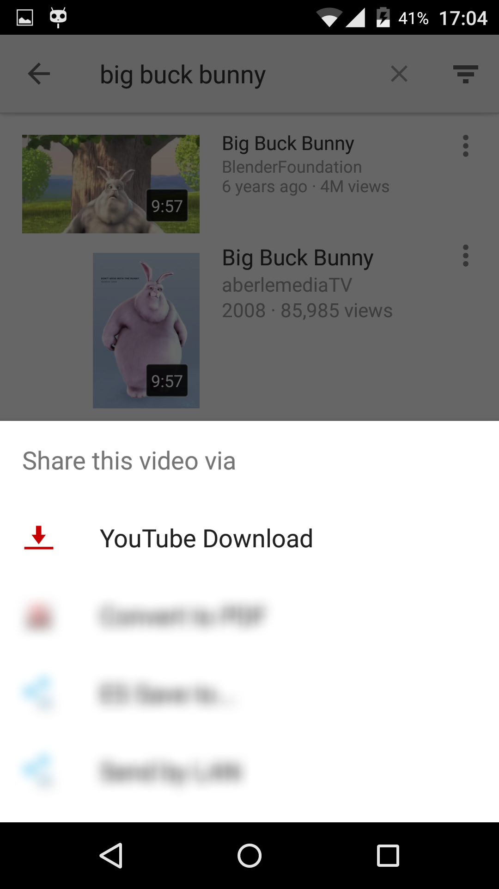
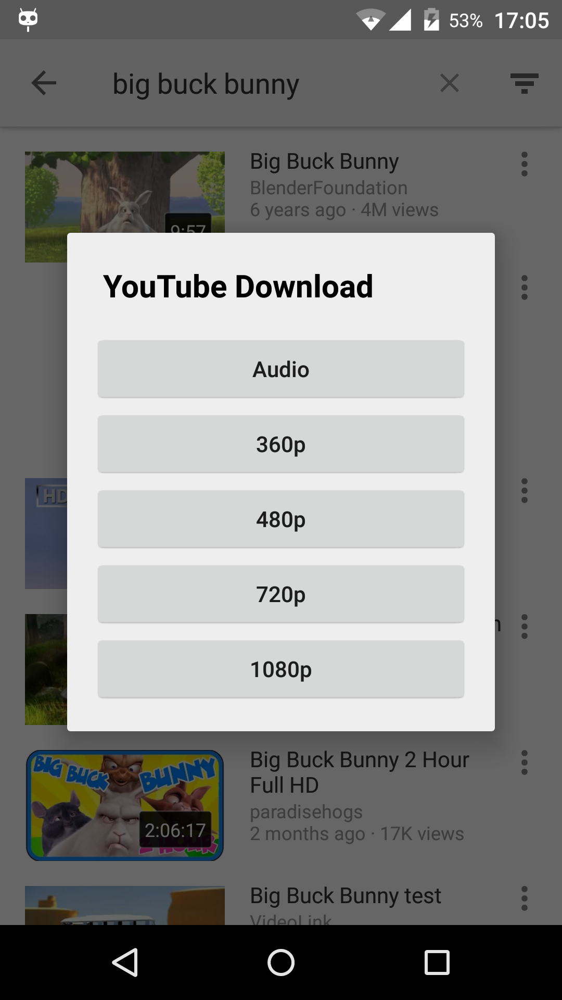

Android based YouTube url extractor
=======================================================

These are the urls to the YouTube video or audio files, so you can stream or download them.
It features an age verification circumvention and a signature deciphering method (mainly for vevo videos).

* Builds: [](https://jitpack.io/#HaarigerHarald/android-youtubeExtractor)
* Dependency: [js-evaluator-for-android](https://github.com/evgenyneu/js-evaluator-for-android)

## Gradle

To always build from the latest commit with all updates. Add the JitPack repository:

```java
repositories {
    maven { url "https://jitpack.io" }
}
```

And the dependency:

```java	
implementation 'com.github.HaarigerHarald:android-youtubeExtractor:master-SNAPSHOT'
```

## Usage

It's build around an AsyncTask. Called from an Activity you can write:

```java	
String youtubeLink = "http://youtube.com/watch?v=xxxx";

new YouTubeExtractor(this) {
    @Override
    public void onExtractionComplete(SparseArray<YtFile> ytFiles, VideoMeta vMeta) {
        if (ytFiles != null) {
            int itag = 22;
	    String downloadUrl = ytFiles.get(itag).getUrl();
        }
    }
}.extract(youtubeLink, true, true);
```

The ytFiles SparseArray is a map of available media files for one YouTube video, accessible by their itag 
value. For further infos about itags and their associated formats refer to: [Wikipedia - YouTube Quality and formats](http://en.wikipedia.org/wiki/YouTube#Quality_and_formats).

## Configuration
    
There are 2 configuration options set via extract:
    
```java
extract(youtubeLink, /*parseDashManifest*/ true, /*includeWebm*/ true);
```

**parseDashManifest**

The dash manifest contains dash streams and usually additionally the higher quality audio formats.
But the main difference is that dash streams from the dash manifest seem to not get throttled by the YouTube servers.
If you don't use the dash streams at all leave it deactivated since it needs to download additional files for extraction.

Known issue: the dash manifest can't be parsed for signature enciphered videos


**includeWebm**

If set to false it excludes the webm container format streams from the result.

## Requirements

Android **4.0** (API version 14) and up for Webview Javascript execution see: [js-evaluator-for-android](https://github.com/evgenyneu/js-evaluator-for-android).
Not signature enciphered Videos may work on lower Android versions (untested).

## Limitations

Those videos aren't working:

* Everything private (private videos, bought movies, ...)
* Unavailable in your country
* RTMPE urls (very rare)


## Modules

* **youtubeExtractor:** The extractor android library.

* **sampleApp:** A simple example downloader App.

* **advancedDownloader:** A more sophisticated App using the [mp4parser](https://github.com/sannies/mp4parser) library to mux dash audio and video files together and add metadata to audio files after downloading. [youtubeDownloader.apk](https://github.com/HaarigerHarald/android-youtubeExtractor/releases/latest)







## License

Modified BSD license see [LICENSE](LICENSE) and 3rd party licenses depending on what you need
